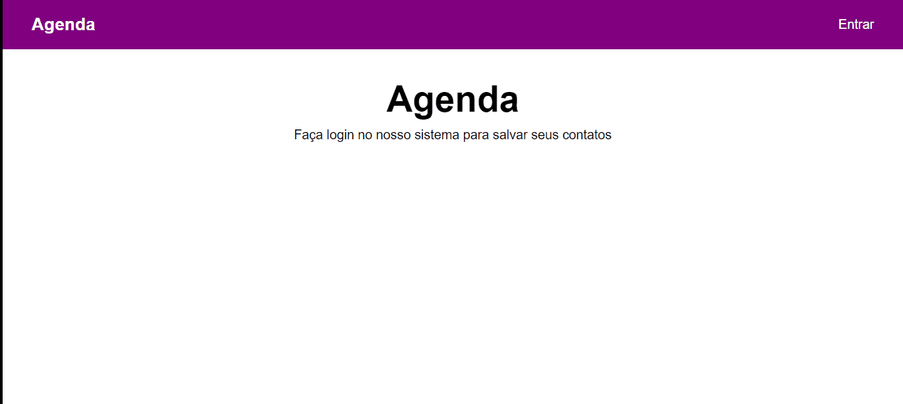
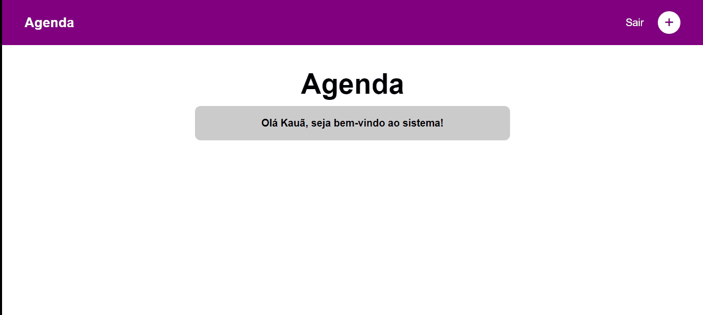
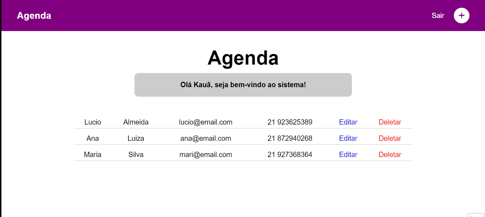

<h1 align="center">Agenda</h1>

Um aplicativo para anotar seus contatos

## Features ✨

- [x] Cadastro de usuário
- [x] Login de usuário
- [x] Logout de usuário
- [x] Listar contatos
- [x] Adicionar contatos
- [x] Apagar contatos
- [x] Editar contatos

## Demo 📷

<h1 align="center">
    
</h1>

<h1 align="center">
    
</h1>

<h1 align="center">
    
</h1>

## Pré requisitos

- [Git](https://git-scm.com)
- [Node.js](https://nodejs.org/en/)

É bom que tenha um [Vscode](https://code.visualstudio.com/) para editar o código

 

## Tecnologias

- [Node.js](https://nodejs.org/en/)
- [React.js](https://pt-bt.reactjs.org/)
- [Javascript](https://www.javascript.com/)

---

## Rodando a aplicação

Para testar a aplicação por você mesmo só acessar [aqui](https://effulgent-palmier-82046d.netlify.app/)

---

Obrigado a atenção de quem veio até aqui 🧡 | [Linkedin](https://www.linkedin.com/in/kau%C3%A3-borba-390946235/) 